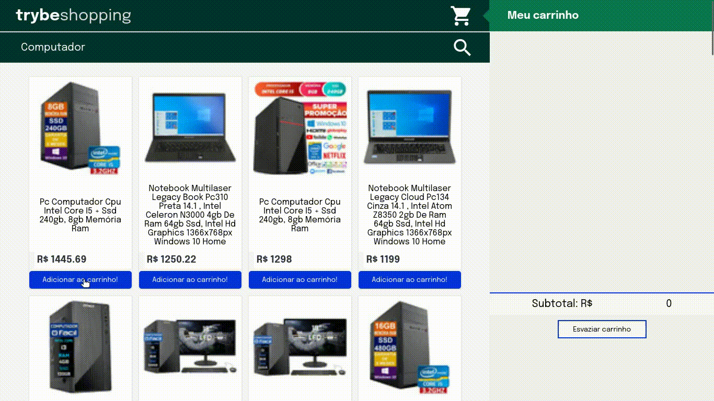

# Welcome to the Shopping Cart project repository!

Here you can find the [Shopping Cart project](https://lucasdximenes.github.io/other/projects/shopping-cart/)! This project is a sample project for consuming APIs. Made by [Lucas Ximenes](https://www.linkedin.com/in/lucasdximenes/)



<details>
  <summary><strong>👨‍💻 What was developed</strong></summary><br />

A fully dynamic **shopping cart** has been developed! 🛒

For this, a **API!** was consumed 🤩

From the acronym _Application Programming Interface_, an API is a point of contact on the internet with a certain service and in this project the Mercado Livre API was used to search for products for sale. 🏷

Test-driven development was used in this project, the famous TDD (Test Driven Development)! Which helps ensure quality code, understanding your application's use cases and ensuring it's working correctly! 🚀

</details>

# guidelines

<details>
  <summary><strong>‼️ Before running</strong></summary><br />

1. Clone the repository

- `git clone git@github.com:lucasdximenes/shopping-cart.git`.
- Enter the repository folder you just cloned:
  - `cd shopping cart`.

2. Install the dependencies and initialize the project

- Install dependencies:
  - `npm install`

</details>

<details>
  <summary><strong>🛠 Tests</strong></summary><br />

In this project I implemented TDD (Test Driven Development) also known as _test-oriented development_, which is a practice widely used in the job market to ensure that the code will be implemented correctly. That is, we first write the test for a function and then implement the logic for the function to execute.

I implemented the test for four functions: `fetchProducts`, `fetchItem`, `saveCartItems` and `getSavedCartItems`.

### Test Coverage

To assess whether the tests are covering the entire function, the **test coverage** was used, which evaluates the effectiveness of the tests implemented according to the requirements, determining whether they cover what was requested or not.

To run the tests, run the command below:

```bash
npm test
```

To run and monitor the implementation of your test coverage, run the command below:

```bash
npm run test:coverage
```

</details>

<details>
<summary><strong>🏗 Project Structure</strong></summary><br />

The `scripts.js` file contains an initial code structure, which creates some HTML elements.

It is in `script.js` that the logic to develop the project was implemented.

<details>
  <summary>
    Click here to learn more about what each function does
  </summary> <br />

- `createProductImageElement`: Creates an image element;
- `createCustomElement`: Structure to create an element;
- `createProductItemElement`: Creates the product list;
- `getSkuFromProductItem`: Gets the `id` of a product;
- `cartItemClickListener`: Listens for the action of clicking on an item in the cart;
- `createCartItemElement`: Creates cart elements.

</details>

The `helpers` folder contains the files `fetchItem.js`, `fetchProducts.js`, `getSavedCartItems.js` and `saveCartItems.js` that contain functions that will be used in JavaScript code.

The `tests` folder contains the files `fetchItem.test.js`, `fetchProducts.test.js`, `getSavedCartItems.test.js` and `saveCartItems.test.js`, where the tests for each of the functions of the same name.

</details>

<details>
<summary><strong>⚙️ Mercado Livre API</strong></summary><br />

The [Mercado Livre API manual](https://developers.mercadolivre.com.br/pt_br/itens-e-buscas) contains all the information about the API (return, structure). In this project, only some of the _endpoints_ were used, namely:

- `https://api.mercadolibre.com/sites/MLB/search?q=$QUERY`: brings a list of products, where `$QUERY` is the term to be searched. For example, if the term is `computer`, the return will look like this:

  <details>
    <summary>Return from product listing request</summary>

  This return has a lot of information about the product list. Inside the `results` array is where you will find the list of products.

  ```json
  {
    "site_id": "MLB",
    "query": "computer",
    "paging": {
      "total": 406861,
      "offset": 0,
      "limit": 50,
      "primary_results": 1001
    },
    "results": [
      {
        "id": "MLB1341925291",
        "site_id": "MLB",
        "title": "Intel Core I5-9400f 6 Core 128 Gb Processor",
        "seller": {
          "id": 385471334,
          "permalink": null,
          "power_seller_status": null,
          "car_dealer": false,
          "real_estate_agency": false,
          "tags": []
        },
        "price": 899,
        "currency_id": "BRL",
        "available_quantity": 1,
        "sold_quantity": 0,
        "buying_mode": "buy_it_now",
        "listing_type_id": "gold_pro",
        "stop_time": "2039-10-10T04:00:00.000Z",
        "condition": "new",
        "permalink": "https://www.mercadolivre.com.br/processador-intel-core-i5-9400f-6-nucleos-128-gb/p/MLB13953199",
        "thumbnail": "http://mlb-s2-p.mlstatic.com/813265-MLA32241773956_092019-I.jpg",
        "accepts_mercadopago": true,
        "installments": {
          "quantity": 12,
          "amount": 74.92,
          "rate": 0,
          "currency_id": "BRL"
        },
        "address": {
          "state_id": "BR-SP",
          "state_name": "São Paulo",
          "city_id": "BR-SP-27",
          "city_name": "São José dos Campos"
        },
        "shipping": {
          "free_shipping": true,
          "mode": "me2",
          "tags": ["fulfillment", "mandatory_free_shipping"],
          "logistic_type": "fulfillment",
          "store_pick_up": false
        },
        "seller_address": {
          "id": "",
          "comment": "",
          "address_line": "",
          "ZIP code": "",
          "country": {
            "id": "BR",
            "name": "Brazil"
          },
          "state": {
            "id": "BR-SP",
            "name": "Sao Paulo"
          },
          "city": {
            "id": "BR-SP-27",
            "name": "São José dos Campos"
          },
          "latitude": "",
          "longitude": ""
        },
        "attributes": [
          {
            "source": 1,
            "id": "ALPHANUMERIC_MODEL",
            "value_id": "6382478",
            "value_struct": null,
            "values": [
              {
                "name": "BX80684I59400F",
                "struct": null,
                "source": 1,
                "id": "6382478"
              }
            ],
            "attribute_group_id": "OTHERS",
            "name": "Alphanumeric Template",
            "value_name": "BX80684I59400F",
            "attribute_group_name": "Others"
          },
          {
            "id": "BRAND",
            "value_struct": null,
            "attribute_group_name": "Other",
            "attribute_group_id": "OTHERS",
            "source": 1,
            "name": "Brand",
            "value_id": "15617",
            "value_name": "Intel",
            "values": [
              {
                "id": "15617",
                "name": "Intel",
                "struct": null,
                "source": 1
              }
            ]
          },
          {
            "name": "Item Condition",
            "value_id": "2230284",
            "attribute_group_id": "OTHERS",
            "attribute_group_name": "Other",
            "source": 1,
            "id": "ITEM_CONDITION",
            "value_name": "New",
            "value_struct": null,
            "values": [
              {
                "id": "2230284",
                "name": "New",
                "struct": null,
                "source": 1
              }
            ]
          },
          {
            "id": "LINE",
            "value_name": "Core i5",
            "attribute_group_id": "OTHERS",
            "attribute_group_name": "Other",
            "name": "Line",
            "value_id": "7769178",
            "value_struct": null,
            "values": [
              {
                "id": "7769178",
                "name": "Core i5",
                "struct": null,
                "source": 1
              }
            ],
            "source": 1
          },
          {
            "id": "MODEL",
            "value_struct": null,
            "values": [
              {
                "id": "6637008",
                "name": "i5-9400F",
                "struct": null,
                "source": 1
              }
            ],
            "attribute_group_id": "OTHERS",
            "name": "Model",
            "value_id": "6637008",
            "value_name": "i5-9400F",
            "attribute_group_name": "Other",
            "source": 1
          }
        ],
        "differential_pricing": {
          "id": 33580182
        },
        "original_price": null,
        "category_id": "MLB1693",
        "official_store_id": null,
        "catalog_product_id": "MLB13953199",
        "tags": [
          "brand_verified",
          "good_quality_picture",
          "good_quality_thumbnail",
          "immediate_payment",
          "cart_eligible"
        ],
        "catalog_listing": true
      }
    ]
  }
  ```

  </details>

- `https://api.mercadolibre.com/items/$ItemID`: brings details of a given product, where `$ItemID` is the `id` of the product to be searched. For example, if the `id` of the product is `MLB1341706310`, the return will look like this:

  <details>
    <summary>Return from a product detail request</summary>

  This return brings detailed information about each of the products. For example, the `id` of that product, the `title`, which is the title of the product, `price`, which is the price, and so on.

  ```json
  {
    "id": "MLB1341706310",
    "site_id": "MLB",
    "title": "Gaming Processor AMD Ryzen 5 2600 Yd2600bbafbox 6 Cores 3.9ghz Freefrequency",
    "subtitle": null,
    "seller_id": 245718870,
    "category_id": "MLB1693",
    "official_store_id": 1929,
    "price": 1068,
    "base_price": 1068,
    "original_price": null,
    "currency_id": "BRL",
    "initial_quantity": 93,
    "available_quantity": 0,
    "sold_quantity": 50,
    "sale_terms": [],
    "buying_mode": "buy_it_now",
    "listing_type_id": "gold_special",
    "start_time": "2019-10-15T18:13:00.000Z",
    "stop_time": "2040-01-27T00:26:51.000Z",
    "condition": "new",
    "permalink": "https://produto.mercadolivre.com.br/MLB-1341706310-processador-gamer-amd-ryzen-5-2600-yd2600bbafbox-de-6-nucleos-e-39ghz-de-frequncia-_JM ",
    "thumbnail_id": "852106-MLA42157659481_062020",
    "thumbnail": "http://http2.mlstatic.com/D_852106-MLA42157659481_062020-I.jpg",
    "secure_thumbnail": "https://http2.mlstatic.com/D_852106-MLA42157659481_062020-I.jpg",
    "pictures": [],
    "video_id": null,
    "descriptions": [],
    "accepts_mercadopago": true,
    "non_mercado_pago_payment_methods": [],
    "shipping": {},
    "international_delivery_mode": "none",
    "seller_address": {},
    "seller_contact": null,
    "location": {},
    "coverage_areas": [],
    "attributes": [],
    "warnings": [],
    "listing_source": "",
    "variations": [],
    "status": "paused",
    "sub_status": [],
    "tags": [],
    "warranty": "Factory warranty: 3 years",
    "catalog_product_id": "MLB9196241",
    "domain_id": "MLB-COMPUTER_PROCESSORS",
    "parent_item_id": null,
    "differential_pricing": null,
    "deal_ids": [],
    "automatic_relist": false,
    "date_created": "2019-10-15T18:13:00.000Z",
    "last_updated": "2022-02-05T06:46:48.434Z",
    "health": null,
    "catalog_listing": true,
    "channels": []
  }
  ```

  </details>

  </details>

# Requirements ✅

## 1. (TDD) Develop tests of at least 25% full coverage and 100% of the `fetchProducts` function ✅

<details>
  <summary>
    Implement the necessary tests in the <code>fetchProducts</code> function
  </summary> <br />

The file to implement the test is already created, it is called `fetchProducts.test.js` and is located inside the `tests` folder.

**What you should test:**

- Test if `fetchProducts` is a function;

- Run the `fetchProducts` function with the `'computer'` argument and test if `fetch` has been called;

- Test if, when calling the `fetchProducts` function with the `'computer'` argument, the `fetch` function uses the `'https://api.mercadolibre.com/sites/MLB/search?q=computador' endpoint `;

- Test if the return from the `fetchProducts` function with the `'computer'` argument is a data structure equal to the `computerSearch` object, which is already imported in the file.

- Test if calling the `fetchProducts` function with no argument returns an error with the message: `'You must provide an url'`.

> **Looking at the tip 👀:** Remember to use the `new Error('expected message here')` to compare with the object returned from the API.
> Read carefully what is being asked and implement one test at a time!

⚠️ **Warning:** You must implement all of the above tests, regardless of what is sufficient for test coverage.

**What will be tested:**

- It will be evaluated if the implemented tests reach at least 25% of the total coverage and 100% of the `fetchProducts` function.

</details>

## 2. Create a product listing ✅

<details>
  <summary>
    Use the <code>fetchProducts</code> function to create a product listing using the Mercado Livre API.
  </summary> <br />

The `fetchProducts` function file is already created and is located inside the `helpers` folder and is imported into the HTML file.

- Implement the `fetchProducts` function to return the product listing;

- Use the _endpoint_ `https://api.mercadolibre.com/sites/MLB/search?q=$QUERY`, where:

  - The value of `$QUERY` must be **compulsorily** the term `computer`;

  - The return of products is in the `results` array;

- Use the `createProductItemElement()` function to create the _HTML_ components referring to a product:

  - Add each element returned from the `createProductItemElement(product)` function as a child of the `<section class="items">` element.

**Note:** Use the variables provided in the code, they must refer to the following fields:

- `sku`: is the `id` field returned by the API;
- `name`: is the `title` field returned by the API;
- `image`: is the `thumbnail` field returned by the API.

To execute your `fetchProducts` function just call your `script.js` file;

<details>
<summary>Click here to see API feedback</summary>

```json
{
  "site_id": "MLB",
  "country_default_time_zone": "GMT-03:00",
  "query": "$computer",
  "paging": {...},
  "results": [
    {
      "id": "MLB2025368730",
      "site_id": "MLB",
      "title": "Easy Full Computer Intel Core I3 8gb Ssd 240gb ",
      "seller": {},
      "price": 1859.07,
      "prices": {},
      "sale_price": null,
      "currency_id": "BRL",
      "available_quantity": 100,
      "sold_quantity": 500,
      "buying_mode": "buy_it_now",
      "listing_type_id": "gold_pro",
      "stop_time": "2041-09-12T04:00:00.000Z",
      "condition": "new",
      "permalink": "https://produto.mercadolivre.com.br/MLB-2025368730-computador-completo-facil-intel-core-i3-8gb-ssd-240gb-_JM",
      "thumbnail": "http://http2.mlstatic.com/D_704139-MLB47542929423_092021-I.jpg",
      "thumbnail_id": "704139-MLB47542929423_092021",
      "accepts_mercadopago": true,
      "installments": {},
      "address": {},
      "shipping": {},
      "seller_address": {},
      "attributes": [],
      "differential_pricing": {},
      "original_price": 1999,
      "category_id": "MLB1649",
      "official_store_id": 3807,
      "domain_id": "MLB-DESKTOP_COMPUTERS",
      "catalog_product_id": null,
      "tags": [],
      "order_backend": 1,
      "use_thumbnail_id": true,
      "offer_score": null,
      "offer_share": null,
      "match_score": null,
      "winner_item_id": null,
      "melicoin": null,
      "discounts": null
    },
    // {...} rest of the product list
  ],
  "sort": {...},
  "available_sorts": {...},
  "filters": {...},
  "available_filters": {...}
}

```

</details>

**What will be tested:**

- The element with class `.item` must be each item in the product list.

</details>

## 3. (TDD) Develop tests of at least 50% full coverage and 100% of the `fetchItem` function ✅

<details>
  <summary>
    Implement the necessary tests in the <code>fetchItem</code> function
  </summary> <br />

**What you should test:**

- Test if `fetchItem` is a function;

- Execute the `fetchItem` function with the item argument "MLB1615760527" and test if `fetch` was called;

- Test if, when calling the `fetchItem` function with the item argument "MLB1615760527", the `fetch` function uses the endpoint "https://api.mercadolibre.com/items/MLB1615760527";

- Test if the return of the `fetchItem` function with the item argument "MLB1615760527" is a data structure equal to the `item` object that is already imported in the file.

- Test if calling the `fetchItem` function with no argument returns an error with the message: `'You must provide an url'`.

> **Looking at the tip 👀:** Remember to use the `new Error('expected message here')` to compare with the object returned from the API.
> Read carefully what is being asked and implement one test at a time!

**What will be tested:**

- It will be evaluated if the implemented tests reach at least 50% of the total coverage and 100% of the `fetchItem` function.

</details>

## 4. Add the product to the shopping cart ✅

<details>
  <summary>
    Implement the <code>fetchItems</code> function to return data from a product and add it to the cart.
  </summary> <br />

Each product on the _HTML_ page has a button named `Add to cart` and, by clicking on this button, you must make a request that will return all the details of a product.

- Implement the `fetchItems` function to request the details of only **one** product;

- Use the _endpoint_ `https://api.mercadolibre.com/items/$ItemID`, where `$ItemID` is the `id` of the product to be searched;

- Use the `createCartItemElement()` function to create the _HTML_ components referring to a cart item;

**Note:** `salePrice` is the `price` field returned by the API.

- Add the element returned from the `createCartItemElement(product)` function as a child of the `<ol class="cart__items">` element.

For example, if the `id` of the product is `MLB1341706310`, the _endpoint_ will return something like this:

<details>
<summary><strong>Click here to see API feedback</strong></summary>

```json
{
  "id": "MLB1341706310",
  "site_id": "MLB",
  "title": "Amd Ryzen 5 2600 6 Core 64 Gb Processor",
  "subtitle": null,
  "seller_id": 245718870,
  "category_id": "MLB1693",
  "official_store_id": 1929,
  "price": 879,
  "base_price": 879,
  "original_price": null,
  "currency_id": "BRL",
  "initial_quantity": 0,
  "available_quantity": 0,
  "sold_quantity": 0,
  // [...]
  "warranty": "Factory warranty: 3 years",
  "catalog_product_id": "MLB9196241",
  "domain_id": "MLB-COMPUTER_PROCESSORS",
  "parent_item_id": null,
  "differential_pricing": null,
  "deal_ids": [],
  "automatic_relist": false,
  "date_created": "2019-10-15T18:13:00.000Z",
  "last_updated": "2019-12-20T18:06:54.000Z",
  "health": null,
  "catalog_listing": true
}
```

</details>

**What will be tested:**

- The element with class `.cart__items` must add the chosen item, correctly presenting its id, title and price information.

</details>

## 5. Remove item from shopping cart by clicking on it ✅

<details>
  <summary>
    By clicking on the <strong>product in the shopping cart</strong>, it should be removed from the list.
  </summary> <br />

When clicking on one of the items in the shopping cart, that item must be removed from the list. For that:

- Use the `cartItemClickListener(event)` function to implement the logic needed to remove the item from the cart.

**What will be tested:**

- Remove the item from the shopping cart by clicking on it;

</details>

## 6. (TDD) Develop tests of at least 75% full coverage and 100% of the `saveCartItems` function ✅

<details>
  <summary>
    Implement the necessary tests in the <code>saveCartItems</code> function
  </summary> <br />

The file to implement the test is already created, it is called `saveCartItems.test.js` and is located inside the `tests` folder.

⚠️ **Warning:** Do not change the structure already implemented in the test files, just add the tests inside the `describe` block.

**What you should test:**

- Test if, when executing `saveCartItems` with the `<ol><li>Item</li></ol>` argument, the `localStorage.setItem` method is called;

- Test if, when executing `saveCartItems` with the `<ol><li>Item</li></ol>` argument, the `localStorage.setItem` method is called with two parameters, the first being 'cartItems' and the second being the value passed as an argument to `saveCartItems`.

> **Looking at the tip 👀:** Remember to use the `new Error('expected message here')` to compare with the object returned from the API.
> Read carefully what is being asked and implement one test at a time!

⚠️ **Warning:** You must implement all of the above tests, regardless of what is sufficient for test coverage.

**What will be tested:**

- It will be evaluated if the implemented tests reach at least 75% of the total coverage and 100% of the `saveCartItems` function.

</details>

## 7. (TDD) Develop tests to achieve 100% full coverage and 100% `getSavedCartItems` function ✅

<details>
  <summary>
    Implement the necessary tests in the <code>getSavedCartItems</code> function
  </summary> <br />

The file to implement the test is already created, it is called `getSavedCartItems.test.js` and is located inside the `tests` folder.

⚠️ **Warning:** Do not change the structure already implemented in the test files, just add the tests inside the `describe` block.

**What you test:**

- Test if, when executing `getSavedCartItems`, the `localStorage.getItem` method is called;

- Test if, when executing `getSavedCartItems`, the `localStorage.getItem` method is called with 'cartItems' as a parameter.

> **Looking at the tip 👀:** Remember to use the `new Error('expected message here')` to compare with the object returned from the API.
> Read carefully what is being asked and implement one test at a time!

⚠️ **Warning:** You must implement all of the above tests, regardless of what is sufficient for test coverage.

**What will be tested:**

- It will be evaluated if the implemented tests reach 100% of the total coverage and 100% of the `getSavedCartItems` function.

</details>

## 8. Load the shopping cart when starting the page ✅

<details>
  <summary>
    Save items added to shopping cart to <code>localStorage</code>
  </summary> <br />

When loading the page, the current state of the shopping cart must be loaded from **LocalStorage**. For this to work, shopping cart items must be saved to **LocalStorage**, i.e. the **addition** and **removal** of a product must be addressed so that the list is always up to date.

For that, you will have to implement the `saveCartItems` and `getSavedCartItems` functions that are already created with the names `saveCartItems.js` and `getSavedCartItems.js`, respectively, inside the `helpers` folder.

- Implement the `saveCartItems` function which should have the logic to just **add** the item to `localStorage` in a key called `cartItems`;

- Implement the `getSavedCartItems` function which should have the logic to just **return** the item from `localStorage`.

⚠️ The `saveCartItems` function should **not** retrieve items from `localStorage`. The `getSavedCartItems` function must **not** add an item to `localStorage`.

**What will be tested:**

- The page when refreshed must remain with all items in the cart previously added.

</details>

## 9. Calculate the total value of shopping cart items ✅

<details>
  <summary>
    The element with the <strong>total</strong> value of the products must have the <code>total-price</code> class
  </summary> <br />

Each time the shopping cart is modified, it will be necessary to calculate the total value of the products and present them on the main page of the project. For that:

- Implement a logic to add up all products in the cart;

- Create an element with the `total-price` class and add the text with the total value of the products;

> **Remember 💭:** When adding a product to the cart, a request is made to the API. Make sure that the API has already returned the information before performing the sum of the products.

> **Looking at the tip 👀:** Don't use `toFixed()`, find other alternatives to round values.

**What will be tested:**

- Calculate the total value of shopping cart items asynchronously;

</details>

## 10. Clean the shopping cart ✅

<details>
  <summary>
    implement the logClick on the <code>Empty Cart</code> button to clear the shopping cart
  </summary> <br />

The empty cart button is already implemented, but it still doesn't fulfill its purpose. For that:

- Make sure the button has **compulsorily** the `empty-cart` class;

- Implement logic to remove **all** items from shopping cart;

**What will be tested:**

- Checks the button to clear shopping cart;

</details>

## 11. Add `loading` text during an API request ✅

<details>
  <summary>
    Add an element with the text <code>loading...</code> during API request
  </summary> <br />

A request to the API takes a certain amount of time and during this process the person using the page has no way of knowing if the request was successful or not. Therefore, some form is usually used to show that the request is still in progress. For that:

- Create an element that contains the text `loading...`, which should be displayed somewhere on the page;

- Add the `loading` class to the element that has the text `loading...`;

- Display this element only **during** the API request.

> **Looking at the tip 👀:** You can create a function that adds to the DOM the element with the text `loading...` and another to remove it, what do you think?

**What will be tested:**

- Checks whether to add a "loading" text during an API request.

</details>
